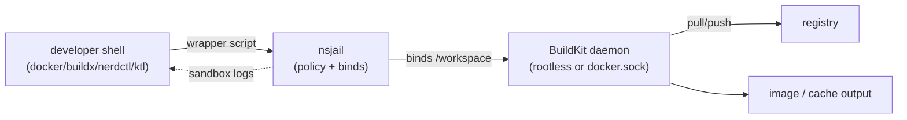
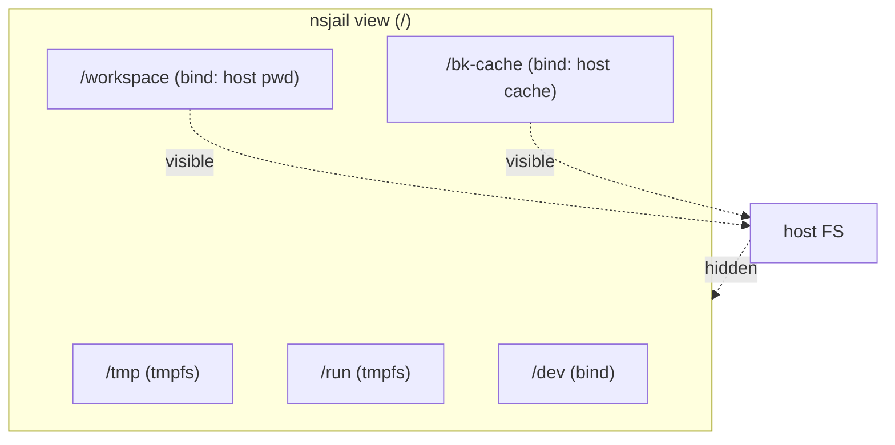
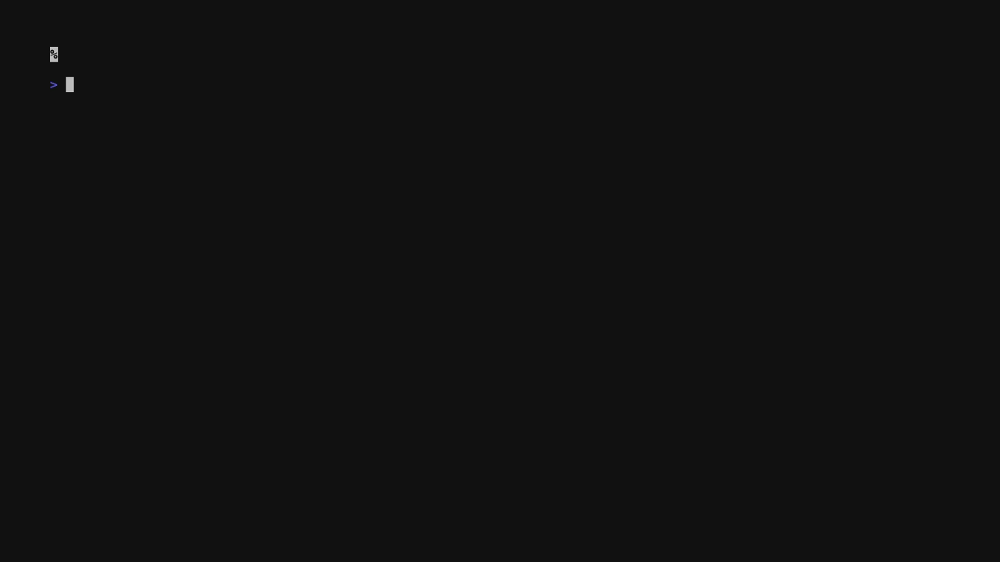

# Putting nsjail in Front of BuildKit: a Practical Sandbox Pattern

> TL;DR: BuildKit is great at building images, not at isolating your host from untrusted Dockerfiles. nsjail gives you namespaces, bind allowlists, and optional no‑egress networking. Re‑exec your build client inside nsjail, bind only context+cache, and you get a portable “fence” you can drop into Docker, buildx, nerdctl, buildctl, ktl, or your CI runners.

## The threat model (why bother?)
Dockerfiles are executable code. An untrusted `RUN` step can:
- read SSH keys, cloud creds, kubeconfigs, npm tokens on the host;
- talk to local sockets (`/var/run/docker.sock`, VM monitors, desktop agents);
- phone home with whatever it finds.
BuildKit itself does not block that—the client passes the build context and any bound sockets straight into the build env. If you build PRs from forks, OSS examples, or arbitrary customer bundles, you need a fence.

## What nsjail adds on top of BuildKit
- **Namespace cage**: new PID, user, UTS, IPC, and (optionally) net namespaces.
- **Filesystem allowlist**: you decide exactly which host paths are visible; default everything else is tmpfs.
- **Network dial**: keep host networking for registries, or flip to `clone_newnet: true` for no‑egress hermetic builds.
- **Drop‑in**: you do not change BuildKit; you just re‑exec the build client inside nsjail with the right binds.

## Core pattern in three steps
1. **Write a policy** (`sandbox/*.cfg`) that defines namespaces, tmpfs roots, and the specific binds you allow.
2. **Wrap your build client** (Docker/buildx/nerdctl/buildctl/ktl) with a small launcher that re‑execs inside nsjail, mounting context, cache, and any required sockets.
3. **Fail closed**: if nsjail is missing or the policy cannot be parsed, stop rather than silently running unsandboxed.

## A minimal, portable policy (linux‑ci flavored)
Save this as `sandbox/linux-ci.cfg` and version it with your code:
```cfg
name: "buildkit-ci"
hostname: "build"
mode: EXECVE
cwd: "/workspace"
clone_newuts: true
clone_newipc: true
clone_newpid: true
clone_newuser: true
clone_newcgroup: true
clone_newnet: false        # set true for no-egress/hermetic builds
keep_caps: false
seccomp_string: "DEFAULT ALLOW"

mount { dst: "/" fstype: "tmpfs" rw: true }
mount { dst: "/proc" fstype: "proc" }
mount { dst: "/tmp" fstype: "tmpfs" rw: true options: "size=2G" }
mount { dst: "/run" fstype: "tmpfs" rw: true options: "size=128M" }
# DNS + CA trust (read-only)
mount { src: "/etc/resolv.conf" dst: "/etc/resolv.conf" is_bind: true }
mount { src: "/etc/hosts" dst: "/etc/hosts" is_bind: true }
mount { src: "/etc/ssl/certs" dst: "/etc/ssl/certs" is_bind: true }
# Device passthrough for tooling
mount { src: "/dev" dst: "/dev" is_bind: true rw: true }
```

## Wrapper #1: Docker buildx (drop‑in for any repo)
Create `bin/build-with-nsjail` and put it in PATH:
```bash
#!/usr/bin/env bash
set -euo pipefail
POLICY=${POLICY_PATH:-$PWD/sandbox/linux-ci.cfg}
BIN=${BIN:-docker buildx}
CTX=${1:-.}; shift || true
CACHE=${CACHE_DIR:-$HOME/.cache/buildkit}
BUILDER=${BUILDER_SOCKET:-/var/run/docker.sock}
mkdir -p "$CACHE"
exec nsjail \
  --config "$POLICY" \
  --bindmount "$PWD:/workspace" \
  --bindmount "$CACHE:/bk-cache" \
  --bindmount "$BUILDER:/var/run/docker.sock" \
  --cwd /workspace \
  -- $BIN build "$CTX" --builder default "$@"
```
Use it:
```bash
POLICY_PATH=$PWD/sandbox/linux-ci.cfg ./bin/build-with-nsjail . -f Dockerfile.untrusted
```
If you run rootless BuildKit or a TCP builder, swap the `--bindmount ... docker.sock` line accordingly.

## Wrapper #2: buildctl (great for hermetic/rootless)
```bash
#!/usr/bin/env bash
set -euo pipefail
POLICY=${POLICY_PATH:-$PWD/sandbox/linux-ci.cfg}
ENDPOINT=${ENDPOINT:-unix:///run/user/1000/buildkit/buildkitd.sock}
CTX=${1:-.}; shift || true
CACHE=${CACHE_DIR:-$HOME/.cache/buildkit}
mkdir -p "$CACHE"
exec nsjail \
  --config "$POLICY" \
  --bindmount "$PWD:/workspace" \
  --bindmount "$CACHE:/bk-cache" \
  --bindmount "${ENDPOINT#unix://}:${ENDPOINT#unix://}" \
  --cwd /workspace \
  -- buildctl --addr "$ENDPOINT" build --local context=. --local dockerfile=. "$@"
```
If you set `clone_newnet: true`, point `ENDPOINT` at a TCP listener on an allowlisted address or a loopback rootless daemon.

## Wrapper #3: nerdctl (containerd users)
```bash
#!/usr/bin/env bash
set -euo pipefail
POLICY=${POLICY_PATH:-$PWD/sandbox/linux-ci.cfg}
CTX=${1:-.}; shift || true
CACHE=${CACHE_DIR:-$HOME/.cache/buildkit}
DAEMON=${DAEMON_SOCKET:-/run/containerd/containerd.sock}
mkdir -p "$CACHE"
exec nsjail \
  --config "$POLICY" \
  --bindmount "$PWD:/workspace" \
  --bindmount "$CACHE:/bk-cache" \
  --bindmount "$DAEMON:/run/containerd/containerd.sock" \
  --cwd /workspace \
  -- nerdctl build "$CTX" "$@"
```

## Case study: ktl embeds this pattern
The `ktl` CLI (BuildKit orchestrator) bakes the pattern in:
- Flags: `--sandbox`, `--sandbox-config`, `--sandbox-bind`, `--sandbox-probe-path`, `--sandbox-logs`, `--hermetic` (`cmd/ktl/build.go`).
- Launcher re‑exec: `internal/workflows/buildsvc/sandbox_linux.go` resolves policy, stages a copy of `ktl` inside the sandbox, binds context as `/workspace`, cache as `/ktl-cache`, builder socket, and any explicit binds.
- Policies versioned under `sandbox/linux-ci.cfg` and `sandbox/linux-strict.cfg` with comments explaining namespace choices.
- Demos: `scripts/sandbox-demo.sh` and `scripts/docker-vs-ktl-sandbox-demo.sh` show baseline vs sandboxed builds, allowlisting, and failure logging.
Borrow the same structure for your own tool: flags to select policy/binds, re‑exec inside nsjail, and logging that fails closed.

### Visual: request flow



### Visual: filesystem view inside nsjail



### ktl code excerpts (Go)

The CLI wiring in Go (simplified) shows all sandbox knobs exposed to users:

```go
// cmd/ktl/build.go
cmd.Flags().BoolVar(&opts.sandboxLogs, "sandbox-logs", false, "Stream sandbox runtime logs")
cmd.PersistentFlags().StringVar(&opts.sandboxConfig, "sandbox-config", "", "Path to nsjail policy")
cmd.PersistentFlags().StringVar(&opts.sandboxBin, "sandbox-bin", "", "Path to nsjail binary")
cmd.PersistentFlags().StringArrayVar(&opts.sandboxBinds, "sandbox-bind", nil, "Additional bind mounts")
cmd.PersistentFlags().BoolVar(&opts.sandboxBindHome, "sandbox-bind-home", false, "Bind-mount $HOME (use sparingly)")
cmd.PersistentFlags().BoolVar(&opts.sandboxRequired, "sandbox", false, "Require sandbox; fail if unavailable")
```

The re‑exec happens right before BuildKit starts. ktl copies its own binary into the sandbox cache, binds context and cache, and launches nsjail:

```go
// internal/workflows/buildsvc/sandbox_linux.go
guestContext := "/workspace"
guestCache := "/ktl-cache"
binds := buildSandboxBinds(contextAbs, guestContext, cacheDir, guestCache, builderAddr, opts.SandboxBindHome, homeDir, opts.SandboxBinds)

args := []string{"--config", configPath, "--cwd", workdir}
for _, b := range binds { args = append(args, b.flag, b.spec) }
args = append(args, "--", sandboxExeGuest)
args = append(args, os.Args[1:]...)

sandboxCmd := exec.Command(bin, args...)
sandboxCmd.Env = append(os.Environ(), "KTL_SANDBOX_ACTIVE=1", "KTL_SANDBOX_CONTEXT="+guestContext)
```

ktl is still evolving; today sandboxing is supported on Linux with nsjail installed. macOS runners skip the sandbox demos by design, and Windows support is on the roadmap but not ready. The patterns above stay the same: ship versioned policies, fail closed when nsjail is absent, and keep demos/tests alongside the code.

ktl (our in-progress BuildKit orchestrator) embeds nsjail by default on Linux: it re-execs itself inside the sandbox, binds only the build context/cache/builder socket, and fails closed if nsjail or the policy is missing.

**Local help + flags preview:**



**Remote SSH build (Linux host, nsjail + BuildKit on the server):**


*End-to-end sandboxed build of the `sandbox-strict` fixture over SSH with nsjail enforcing the policy server-side.*

### Other ktl build surfaces to try locally (macOS ok)

- **Hermetic, no egress:** `ktl build . --hermetic --sandbox-config sandbox/linux-ci.cfg --sandbox --sandbox-logs`  
  Uses the embedded `ktl-hermetic.cfg` (no network) when `--hermetic` is set. On macOS it will fall back gracefully if nsjail is unavailable.
- **Probe before build:** `ktl build . --sandbox --sandbox-config sandbox/linux-ci.cfg --sandbox-probe-path /etc/shadow --sandbox-logs`  
  Prints whether the host path is visible before starting BuildKit; handy for verifying policy changes.
- **Selective home bind:** `ktl build . --sandbox --sandbox-config sandbox/linux-ci.cfg --sandbox-bind $HOME/.docker/config.json:/workspace/.docker/config.json`  
  Showcases allowlisting a single credential file instead of mounting your whole home.
- **Log streaming:** `ktl build . --sandbox --sandbox-config sandbox/linux-ci.cfg --sandbox-logs --output logs`  
  Streams nsjail runtime logs alongside BuildKit output; useful when policies block something unexpectedly.

## CI recipes (copy/paste)
### GitHub Actions (self-hosted Linux runner)
```yaml
jobs:
  build:
    runs-on: self-hosted
    steps:
      - uses: actions/checkout@v4
      - name: Install nsjail
        run: sudo apt-get update && sudo apt-get install -y nsjail
      - name: Build with nsjail + buildx
        run: |
          POLICY_PATH=$PWD/sandbox/linux-ci.cfg \
          BIN="docker buildx" \
          ./bin/build-with-nsjail . -t ghcr.io/acme/app:pr-${{ github.sha }}
```
Fail the job if `nsjail` is missing; do not fallback.

### GitLab CI
```yaml
stages: [build]
build-image:
  stage: build
  tags: [linux]
  script:
    - apt-get update && apt-get install -y nsjail
    - POLICY_PATH=$CI_PROJECT_DIR/sandbox/linux-ci.cfg BIN="docker buildx" ./bin/build-with-nsjail . -t registry.gitlab.com/acme/app:$CI_COMMIT_SHA
  artifacts:
    paths: [nsjail.log]
```

### Jenkins declarative
```groovy
pipeline {
  agent { label 'linux' }
  stages {
    stage('build') {
      steps {
        sh 'sudo apt-get install -y nsjail'
        sh 'POLICY_PATH=$WORKSPACE/sandbox/linux-ci.cfg BIN="docker buildx" ./bin/build-with-nsjail . -t registry.local/app:${BUILD_NUMBER}'
      }
    }
  }
}
```

## Hardening knobs
- **Hermetic/no‑egress**: set `clone_newnet: true`; drop docker.sock; use rootless or remote BuildKit.
- **Secrets hygiene**: prefer passing registry creds via `--secret` or build args; do not bind the full home directory. If unavoidable, bind only the needed file (`--bindmount $HOME/.docker/config.json:/workspace/.docker/config.json`).
- **Per‑trust caches**: use separate caches for untrusted inputs (`~/.cache/buildkit-untrusted`).
- **Probe before build**: run `nsjail ... stat /etc/shadow` to verify host paths are hidden.
- **Log everything**: always set `--log` and keep artifacts so you can debug policy denials without rerunning unsandboxed.

## Troubleshooting quick hits
- `nsjail: CLONE_NEWUSER not permitted`: enable user namespaces on the host or drop `clone_newuser: true` (reduces isolation slightly).
- Build fails with seccomp/thread errors: keep `seccomp_string: "DEFAULT ALLOW"` unless you ship a tailored profile.
- Build cannot reach registry in hermetic mode: either allow egress selectively (add a veth or allowlisted socket) or stage base images in a local registry bound into the sandbox.
- Docker socket missing: if you remove docker.sock (good), point BuildKit to a rootless or TCP endpoint instead.

## Longer real-world scenarios
- **Agency CI for customer projects**: run the wrapper with `clone_newnet: true`, per‑customer caches, and no docker.sock. Push images via a remote BuildKit endpoint behind an allowlist.
- **Desktop contributor workflow**: developers keep the wrapper script in PATH; when reviewing PRs from forks, builds automatically enter nsjail with `--sandbox-logs` so policy errors are obvious.
- **Supply-chain attestation**: combine nsjail with reproducible builds. Use the same policy in CI and on dev machines; if outputs diverge, you know it is not because of host leakage.

## Why keep policies in git
Policies are code. Reviewing `sandbox/*.cfg` alongside the app code makes the threat surface auditable. ktl ships `linux-ci` and `linux-strict` profiles in‑repo for exactly this reason; do the same for your tools.

## Checklist to productionize
- [ ] Policy lives under `sandbox/` and is reviewed like code.
- [ ] Wrapper scripts fail if nsjail or the policy is missing.
- [ ] CI jobs export logs on failure.
- [ ] Separate caches for trusted vs untrusted inputs.
- [ ] Optional hermetic mode tested (`clone_newnet: true`).
- [ ] Docs include a one-liner to prove isolation (`stat /etc/shadow` should be hidden).

## Closing
BuildKit is a fantastic builder but it will happily show your host to any Dockerfile you hand it. Wrapping the build client in nsjail is a small amount of glue code plus a policy file, and it works the same for Docker, buildx, nerdctl, buildctl, ktl, or any bespoke CLI. Version the policy, keep the wrapper in PATH, fail closed, and you have a portable sandbox that lets you say “yes” to untrusted builds without risking the laptop or runner underneath.
